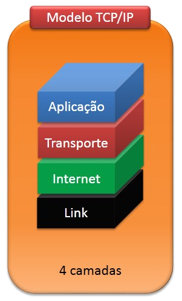

# devops-network
Reposito com os conhecimentos minimos de redes para utilizacao no dia a dia. 

## Camada TCP



Nas primeiras camadas temos alguns protocolos que sao usados no dia a dia ou que e preciso ter conhecimento deles.

camada de aplicação: HTTP, Telnet, DNS, PING, FTP, SSH, POP3, SMTP, IMAP;

camada de transporte: TCP, UDP;

camada de rede: IP, IPsec, ICMP;


## Camada Aplicacao

**SMTP**: protocolo que faz a conexao do servidor de email com o email cliente da maquina.
**POP3**: Protocolo para o cliente acessa o servidor de email. Esse protocolo baixa todos os email do servidor, armazenando os email na maquina do cliente.
**IMAP**: Protocolo para o cliente acessa o servidor de email. Esse protocolo faz apenas uma copia dos email que estao no servidor, deixando uma copiado no servidor.

```bash
Commandos utilizados

# returns 'words'
foobar.pluralize('word')

```

## Camada Transporte

Na camada de transporte existe o protocolo UPD e o TCP. Essa sao as diferencas entre eles:

**TCP**: A comunicacao com esse protocolo e feita utilizando o metodo handshake onde as duas maquinas precisam confirma comunicacao. So depois da confirmacao entre ambas que o processo de enviou de pacotes e iniciado. Nesse protocolo a perda de pacote e notada e caso precise e reenviado novamente.

**UDP**: Nesse protocolo o pacote e apenas enviado, sem precisa as duas maquinas valida comunicacao, alem de o monitoramento de perda de pacote nao existir.

```bash
Commandos utilizados

# returns 'words'
foobar.pluralize('word')

```

## Camada Redes

camada de rede: IP, IPsec, ICMP, IGMP

### IP
**IP**: O protocolo IP e o responsavel por receber os pacores do procotoco TCP/UDP e enviar. O sistema de enderecamento utilizado na camada de redes e o endereco logico e endereco fisico.

Com o enderecamento logico nao e necessario saber o enderecamento de ip fisico da maquina, o protocolo ARP e RARP sao responsaveis por receber o ip logico e identificar qual ip fisico corresponde. *Contudo o protocolo RARP foi subistituido pelo protocolo DHCP*

**Tipos de enderecamento IPV4**
unicast: unico ip
broadcast: 
anycast: varios servidores com o mesmo ip, muito usado no CDN. usado junto com o protocolo BGP

### IPsec

Consegue fazer a protege o cabecalho do TCP alem de fazer a autenticacao, integridade, confidencialidade dos pacotes.
O IPsec substitui o cabecalho do IP.

### ICMP

Mensagem do ICMP sao geradas diretamenta da camada de rede da origem, assim nao tem cabeçalho de TCP e IP.

```bash
Comando utilizado

# enviando um 'echo' para validar acesso ao destino.
ping $destino(ip/dns)


# Motirando o caminho do 'eco' ate destino.
traceroute $destino(ip/dns)
```

apos executar o ping e possivel identifica qual SO esta sendo usado no destino, baseado no TTL, conforme a tabela abaixo:
UNIX: 64
Windows: 128
AIX/Solaris/Cisco: 254/255

O traceroute ira registra todos os saltos feito pelo eco ate chegar o destino final.

A fraquementacao do dado e com base no tamanho do MTU(Maximum Transmission Unit), caso o pacote seja maio que o mtu estabelecio o pacote sera fraquementado para ser enviado

### Roteamento

O roteador quando recebe o pacote faz o encaminhamento com base na rota mais curta ate o destino, isto e o caminho com menos saltos. Outra forma de roteamento e com base no caminho mais rapido. 

## Diagnostico de redes

Case: